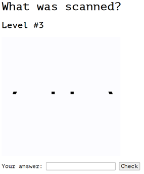

# Scanner — CyBRICS CTF 2021
<i>Write-Up Date: 26-Jul-2021</i>

The task says that we need to play a game to get the flag. However, we can only see the flag at level 5. Let’s play!.

When we open the link, we see a kind of scan that only shows a tiny part of the image for each frame of the gif. However, we can see more or less the image (until level 5).

Those images change every time that you play the game, only the first image and last one (level #1 and level #5) are always the same -> “House” and the QR code.

<strong>Answer</strong> : House

<strong>Answer</strong> :fish

<strong>Answer</strong> : bluetooh

<strong>Answer</strong> : apple

In level #5 we can see that scan looks like a <strong>QR code</strong>. However, the answer is not “QR Code”.

My hypothesis was: maybe if we put every frame together, we can rebuild the QR code. Let’s try it.

Here are the steps:

1. Download the QR code gif
2. Go to https://ezgif.com/ in order to separate all the frames of the gif
3. Click on “Crop”
4. Upload your Gif file
5. Just select the area of the scan
6. Click on “Crop Image!”
7. Then click on “frames”

8. Download the frames

Now I need to put together all the frames to recreate the QR Code. For this, I used Photoshop but you can use any image editor.

Final Result:

The QR gives us the flag:

**Flag** : `cybrics{N0w_Y0u_4r3_4_c4sh13r_LOL}`

## ALTERNATIVE SOLUTION TO SPLIT THE FRAMES IN COMMAND LINE

If you like using the command line maybe this alternative is for you. One of my teammates <a href="https://twitter.com/p00rduck">@p00rduck</a> has a more elegant way to split the frames (and faster). Run this command in your terminal:

`gm convert QR_CODE.gif +adjoin %3d.png`

**QR_CODE.gif** is the gif file that you downloaded from the challenge.

This command will split all the frames then you can use any image editor to assemble all the frames to recreate the QR Code.