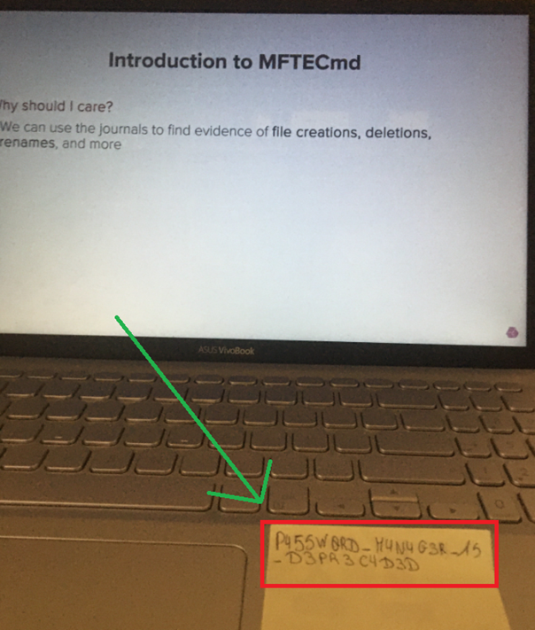
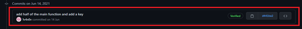

# Forensics Challenges — CyberThreatForce CTF 2021
<i>Write-Up Date: 19-Jul-2021</i>

**TOOLS USED**: `Volatility` 

## INTRODUCTION:

For this writeup, I wrote about something that I never did before, FORENSICS!

I would like to say that it was my first time using Volatility and doing Memory Forensics.

I put a lot of details in this writeup. It is my way to learn how to use Volatility but also to show you how you can use this amazing tool if you are a beginner.

In this CTF, we have 5 different challenges around the same file (<strong>mem.raw</strong>). That is why I put all those challenges in the same writeup.
Let’s start!

## CHALLENGES:

<h3>Deep In My Mind (75 points)</h3>

**Hello Agent, We were able to get our hands on the RAM dump of a pc belonging to the APT403, Find us the potential profile (volatility profile) of the memory dump.**

<i>Flag format: CYBERTF {volatility profile}</i>

<i>File to download: <strong>mem.raw</strong></i>

First, when you start to investigate with Volatility, you need to find the right profile. Basically, the profile is the version of the OS that they did the memory dump.

To find the <strong>Volatility Profile</strong>, we run the “<strong>imageinfo</strong>” command in Volatility. It will provide us several profiles. Most of the time, the right profile is always the first one. However, it could be a different one. For this challenge, the first profile was the right one.

Pretty easy this one, right? We just found our first flag.

**Flag** : `CYBERTF{Win7SP1x64}`

<h3>More Deeper (100 Points)</h3>

**Can you see what is written in the notepad? (Use the file downloaded from In the back of my mind)**

Now that we have the right profile we can start to go deeper into our investigation.

The first thing that we need to do here is to discover the right <strong>PID</strong> of the <strong>notepad.exe</strong> program. To see all the PIDs we can use the command “<strong>pslist</strong>”.

As you can see in the image above, when you run this command, it shows the <strong>Offset(v)</strong>, the <strong>Name</strong> of the program, the </<strong>PID</strong>, and other information.

From here you have two options, you check it manually or you can use grep to only shows the notepad.exe program (personally I used grep).

Great, now we know that the <strong>PID number is 628.</strong>

The next step is: we need to extract the <strong>memdump</strong> of this program. In order to do this, I will use this command with the right PID (notepad.exe’s PID):

After running this command, a new file will be created in the folder that you are working(in this case <strong>628.dmp</strong>)

In this file you have a lot of information, to extract the information that you need, you will need to use your bash skills 😊. Let’s “<strong>strings</strong>” then “<strong>grep</strong>” only the word “<strong>CYBER</strong>” as we know that the flag starts with this word.

Nice! We found the second flag!

**Flag:** `CYBERTF{D33P3R_TH4N_TH3_M4R14NN4_TR3NCH}`

<h3>Almost At The Bottom (100 Points)</h3>

**Which Twitter account did the user visit? for the flag, we want the name of the Twitter account without @ For example CYBERTF {elonmusk} (Use the file downloaded from In the back of my mind)**

This one was tricky for me. The challenge says that we need to find information related to a Twitter account, but how?

After a moment, I realized that to use Twitter we need to use a browser, right? In this case, we need to check all the information that we can found in the browser used by this user.

The most used browsers can be Internet Explorer, Chrome, Firefox etc. So if you use again the “<strong>pslist</strong>” command you will see that the user used <strong>Internet Explorer (explorer.exe)</strong> as browser.

As we know that the user used this program let’s extract all the information related to this program. (here I used the same method of the last challenge). By the way, the <strong>PID</strong> of <strong>explorer.exe</strong> is <strong>2808</strong>.

Like the previous challenge, a new file has been created (2808.dmp) in my folder.

Now we need to find all the information related to Twitter in this file. In order to do this, I used the same command as we saw before, but I changed to the word “<strong>twitter</strong>” this time.

Ok, so the user visited several times this profile. We just found the 3er flag as the challenge only asks for the <strong>Twitter username</strong>.

**Flag:** `CYBERTF{GagarineI}`

<h3>You Are Almost There (100 points)</h3>

**What is the password hidden in Twitter? (Use the file downloaded from Deep in My Mind)**

Here we do not need to use Volatility, basically, it is only a little OSINT challenge.
We just need to go to this Twitter account: https://twitter.com/GagarineI

If you open the first picture “Introduction to MFTECmd”, you will find the 4th flag.

**Flag:** `CYBERTF{P455W0RD_M4N4G3R_15_D3PR3C4D3D}`

<h3>You Are Arrived (100 points)</h3>

**What is the flag hidden in the visited Github? (Use the file downloaded from Deep in My Mind)**

This challenge is like the Twitter one. You know that a way to access GitHub profile is using the browser, right? Let’s check what we can see in the <strong>explorer.exe</strong> memdump (here I used the same file that I had already extracted, the <strong>2808.dmp</strong>).

As you can see the user visited several times the https://github.com/1v4n0v profile.

Let’s do a little <strong>OSINT</strong> in this Github profile.

Ok… we can see that there are some activities (and those activities are public!)

As the activities are public, we can see the commits.

If you check the commit of the 14th June, you will find a cipher.

It looks like **Base64**. Let’s decrypt it with **CyberChef**:

Amazing we just found our last flag!

**Flag:** `CYBERTF{TH4NK_Y0U_L1NU5_F0R_G1T}`

## CONCLUSION:

I can say that I was out of my comfort zone, and I really enjoyed it.

It was a great experience because I needed to learn everything from scratch, googling around, and trying to find my way.

I could help my team earn a total of <strong>475 points</strong> by solving those challenges! It was awesome. 💪

If you want to learn more about Forensics and do some challenges, I advise you to try out this room on TryHackMe. <a href="https://tryhackme.com/room/bpvolatility"> https://tryhackme.com/room/bpvolatility</a>

I hope that my writeup helped you to understand better all the aspects of this CTF. If you want to read more writeups like this one or have any questions, you can find me on Twitter <a href="https://twitter.com/dropn0w">@drop</a>.

Stay safe, stay curious!