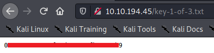
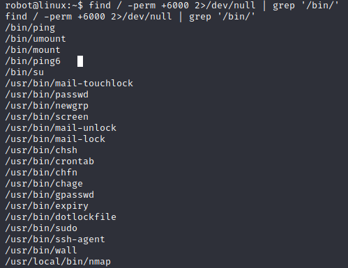

# TryHackMe: Mr.Robot CTF - Beginner Friendly (detailed)

**TOOLS USED**: `nmap`, `Gobuster`, `CyberChef`, `php script (reverse shell)` , `John the Ripper`

## INTRODUCTION:

As a complete beginner, I just looked to this room and saying to myself: “I am not ready…”, “it is a medium room, it should be hard for me…”. I thought I needed to have more knowledge to solve this room, but I solved it quite easily and I will show you all the steps.

<strong>Mr.Robot</strong> is a well-known CTF room on TryHackMe. As you guess, the theme is the same of the show Mr. Robot. Moreover, if you finish this room you receive the Mr. Robot badge, awesome right?

I will try to put as many details as I can, like that, if you are a beginner, you will be able to understand all the steps to solve this room.

## RECON (WITH SCRIPTS):

First, I need to know where we go right? As we can see in the page of the room, it says that we need to find 3 flags (<strong>key 1, key 2 and key 3</strong>).

Let’s start as usual, running nmap to scan all the ports. Some flags:

    <li> -sV : Probe open ports to determine service/version info
    <li> -A : Enable OS detection, version detection, script scanning, and traceroute
    <li> -p- : Scan all ports

As you can see here, we have 3 open ports:
    <li> Port 22 (ssh): This port is closed. It means that we do not need to lose our time trying to brute force it.
    <li> Port 80 (http): Ok, this port is open and runs an Apache webserver. It means that we are in a web challenge.
    <li> Port 443 (ssl/http): Another port running an Apache webserver.

At that moment, I didn’t open my browser yet. Indeed, I am trying to figure out from here I can start to look. nmap shows us that it has a apache webserver, let’s run gobuster to enumerate all the directories:

**Flags**:

    <li> -u : The url that you want to enumerate
    <li> -w: the wordlist that you want to use

We have a lot of interesting pages here. As you can see a lot of those pages have the status 301. Let’s focus on the pages (directories) that we have the status 200:

    <li>/sitemap
    <li>/intro
    <li>/wp-login
    <li>/license
    <li>/readme
    <li>/robots

From here we can already form some hypothesis:

    <li>The website is built in <strong>WordPress</strong>. Indeed, <strong>/wp-login</strong> refers to the path to login to the backend of WordPress. If you have access to this kind of page it is a good sign. A developer should always restrict access to this page. As this page is accessible by everyone maybe we can try to exploit it.
    <li>As the ssh is closed, we will need to find a way to have a <i>remote command execution (RCE)</i> somewhere.

## RECON (MANUAL):

So far so good. Now ^<strong>it is time to open our browser</strong> to check all the “pages/directories” that we have found with the <strong>status 200</strong>. I will start by <strong>/robots</strong> because the goal of this page is to tell the bots of the search engines to not index specific pages. Maybe the dev wants to hide some pages? Let’s find out…

Ok cool! We have 2 important pages.

    <li><strong>Key-1-of-3.txt</strong>: a text file containing something but what?
    <li><strong>Fsocity.dic</strong>: a wordlist, maybe some usernames or passwords?

Nice! In the <strong>/key-1-of-3.txt</strong> we find our first flag. It was easy that one, right?

Let’s check now the page <strong>/license</strong>.

 If you look at this page, it looks a bit empty, right? However, if you check the code source of this page you see something encrypt in base64 (in the < pre > tag). The message is quite clear, apparently, this is a password hashed.

Let’s decrypt it with <strong>CyberChef</strong> :

Ahhhh ! We have two things; it is maybe an username and a password? Let’s try to use that information in the form of the page ***/wp-login.***

Good, it worked and we confirm that we are working with a WordPress website.

## EXPLOITATION Part 1: Setting a reverse shell

Ok, we are log in as Elliot but what does he can do (what is his privileges)? If you know a bit about WordPress, you can check this information in the “<strong>Users</strong>” area.

Ahh… actually, we have 2 users, “<strong>elliot</strong>” and “<strong>mich05654</strong>”. Moreover, elliot is the <strong>administrator</strong>. A good sign right?

As they put another user in this challenge, let’s check how they set this user:

Hmm… it says “another key?” But we cannot find anything else for this user… We could generate a password and connect as “mich05654” but as we are already connected as administrator, I think it is enough to do the things that we want, right (set a reverse shell)?

As elliot has admin privileges, maybe he is able to make changes on the pages. Let’s check it in the <i>Appearance</i> area:

Indeed he has the possibility to Edit pages (**Editor**). If you click on Editor, on the right side you will see templates and pages. You can see that some pages are in **PHP**. So maybe we can change the content of a page and set a reverse shell written in PHP?

In order to set this page with the script, I will use this script => php-reverse-shell and the page <strong>archives.php</strong>

Go to this GitHub repository and copy the write and paste in the page that you want to change. Then set your IP (set your TryHackMe IP) and the port that you will listen.

When you did all the changes, just click on “Update File”.

Before opening your reverse shell don’t forget to open your listener:

Now we will need to find the right path of this page:

When you are editing the page that you want, you can see a URL like the above. As you can see here, we are working in the admin area (/wp-admin). But when we want to see the content of a page, we will need to go to « wp-content (/wp-content). Did we find this wp-content page during our gobuster scan right?
As we are using a kind of theme, the folder containing themes is named « themes » and the name of the theme is « twentyfifteen ». Moreover, we know the name of our file is archive.php (I used this page, but you can use another one if you want). So the full path to open our reverse shell will be :

`http://IPMACHINE/wp-content/themes/twentyfifteen/archive.php`

Nice we are in and we are connected as “daemon”.

## EXPLOITATION Part 2.
------

The first thing that I do when I got a shell, is setting a better shell. In order to do this, I will use a small python script:

`python -c ‘import pty;pty.spawn(“/bin/bash”)’`

We did a lot so far but where is this second key? As we are on the server, let’s list the home directory to see all the users and folders.

Ok, we have only the <strong>robot</strong> folder. Let’s check what it has inside:

Ok… as you can see we don’t have the privileges to read the <strong>key-2-of-3</strong>.txt file. We need to escalate our privilege to <strong>robot</strong> user.

However, in the same folder, we are able to read the password.raw-md5 file. Let’s cat it:

We have here a big hint, it is an md5 hash. Let’s decrypt it with <strong>John the Ripper</strong>.

First, I will create a .txt file on my machine in order to use John The Ripper. Moreover, we need to specify a wordlist. Most of the time I use the wordlist rockyou, so I will try with it.

PS: I think we could use the <strong>Fsocity.dic</strong> wordlist that we found in the /robots. But my first reflex was to use the rockyou wordlist and it worked !

Ok, we found the password. Let’s try to switch to robot user:

$ su robot 
$ password: xxxxxxxxxx

Awesome, it worked! Now we can cat the <strong>key-2-of-3.txt</strong> file.

## PRIVILEGE ESCALATION:

Most of the time the last flag is in the root folder. So, I guess here we will need to find a way to escalate our privileges to the root user.

There are several ways to find how we can escalate your privileges. But as it is a beginner-friendly writeup, let keep it simple, ok?

First, let’s try to use <strong>“sudo -l”</strong>. Ok, it is doesn’t work.

Maybe there is a cron job? To list the cron jobs we use: <strong>“crontab -l”</strong>. No Cron jobs…

Let’s see what kind <strong>SUID binaries</strong> we have in this machine:

I was not aware of how it worked but if you check the <i>hint</i>, it says something about “<stong>nmap</strong>”. So, I think we will need to find something around this <strong>/usr/local/bin/nmap</strong>

Let’s check on GTFOBins to see if they have something about nmap. Before that, first let’s check the version of the nmap :

Ok… as we have this version, let’s check what GTFBins says about it:</p<>>

As we want to pop a root shell, and our version fits with the <strong>option b</strong>, let’s try those commands:

Amazing, it worked! We are <strong>root</strong>! Let’s take our last flag (most of the time this flag is in the root folder) :

Well Done! We have our third and last flag!

## CONCLUSION:

I do not know if it is your case, but I overestimate a bit this room. As the level of the room is “medium”, I told myself that I was not ready for this room (as a beginner).

The lesson of the day:

<i>“Always try hard, whatever you think, or people think! You may have more knowledge than you think.”</i>

As you saw during this writeup, I found all the flags without visiting all the pages of the website. It was a bit pity because the website is well made with the Mr. Robot theme. If you are fun of Mr. Robot, I advise you to play around and having fun with it. The experience is great! Congrats to the devs who built this room.

I hope that my writeup helped you to understand better all the aspects of this CTF. If you want to read more writeups like this one or have any question, you can find me on twitter <a href="https://twitter.com/dropn0w">@drop</a>.

Stay safe and keep learning!
